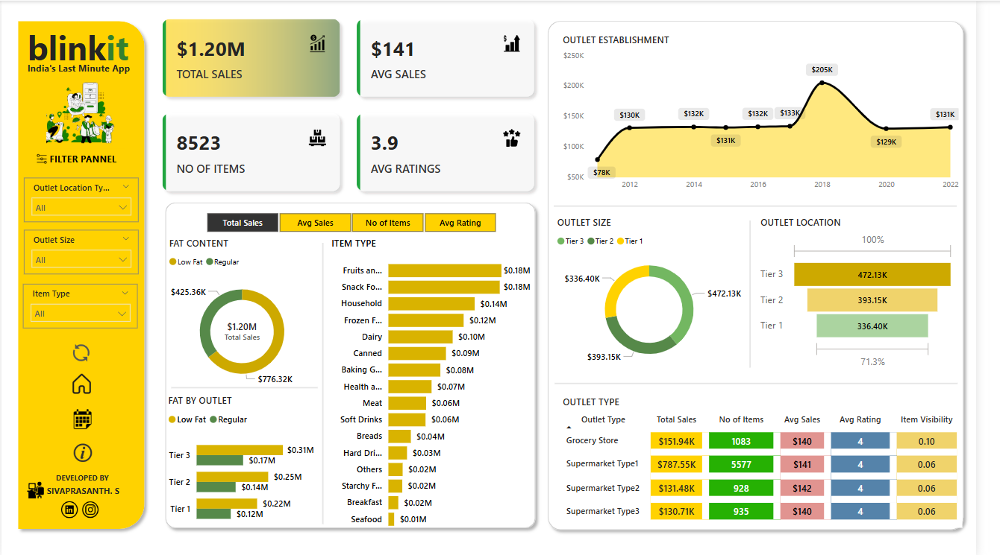

# Blinkit Sales Analysis Dashboard

## Project Description:
The **Blinkit Sales Analysis Dashboard** is a Power BI project aimed at analyzing sales data for Blinkit. The dashboard helps visualize sales trends, product performance, and regional sales insights. It provides valuable insights into sales patterns and helps decision-makers track performance.

## Installation:
To use the Blinkit Sales Analysis Dashboard, follow these steps:
1. **Download** the project files from the GitHub repository.
2. Install **[Power BI Desktop](https://powerbi.microsoft.com/en-us/downloads/)** if you haven’t already.
3. Open the `.pbix` file in Power BI Desktop.
4. Explore the interactive dashboard and data insights.

## Usage:
Once the **Blinkit Sales Analysis Dashboard** is opened in Power BI Desktop:
1. Navigate through the tabs to explore different sales data metrics.
2. Use the interactive filters to analyze sales by region, product category, or time period.
3. Review key KPIs such as **Total Sales**, **Profit Margins**, and **Sales Growth**.

## Key Insights:
Key KPIs Analyzed:
  - Total Sales – Overall revenue generated.
  - Average Sales – Revenue per sale.
  - Number of Items Sold – Total count of different items purchased.
  - Average Rating – Customer satisfaction scores.
Core Visualizations & Business Insights:
📊 Total Sales by Fat Content – Understanding the impact of product composition (Donut Chart).
 📊 Total Sales by Item Type – Identifying top-performing categories (Bar Chart).
 📊 Fat Content vs. Sales Across Outlets – Analyzing regional sales trends (Stacked Column Chart).
 📊 Sales by Outlet Establishment Year – Assessing outlet age influence (Line Chart).
 📊 Sales by Outlet Size – Measuring sales performance by store size (Donut/Pie Chart).
 📊 Sales by Location – Visualizing geographic distribution (Funnel Map).
 📊 Comprehensive Metrics by Outlet Type – Holistic performance review (Matrix Card).
💡 Key Takeaways:
 🔹 Identified trends in sales performance based on product attributes and outlet characteristics.
 🔹 Derived strategic insights to optimize inventory distribution and customer satisfaction.
 🔹 Built an interactive Power BI dashboard for real-time decision-making.

🗂️ Data Gathering From - Data Tutorials 

   

## Features
- **Sales Trends**: Visualizes sales trends over time to identify patterns.
- **Regional Analysis**: Compares sales across different regions (e.g., BLR, KOL, GUR).
- **Product Performance**: Displays the performance of top-selling products.
- **KPI Cards**: Highlights key performance indicators like Total Sales and Profit Margins.

## Technologies Used:
- **Power BI Desktop** for data analysis and visualization.
- **DAX (Data Analysis Expressions)** for calculations and measures.
- **Excel/CSV** (if applicable for data sources).

## License:
This project is licensed under the MIT License - see the [LICENSE.md](LICENSE.md) file for details.
